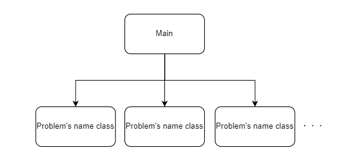

# README

## Constructure  

```
GIT ROOT
└─AtCoderKyoupro90
    ├─AtCoderKyoupro90
    │  └─source programs
    └─doc
        └─001
        	└─memos per problem
```

## Project architecture  

  

Create a class for a problem named problem name.  
Create ```Run()``` method as public, and it called by Main class.  

```CSharp
static void Main(string[] args)
{
    var current = new yokanparty();		// fix current class
    current.Run();
    Console.ReadKey();
}
```

